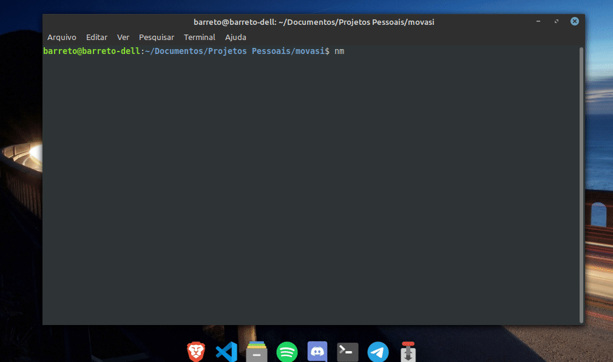

<h1 align='center'>O que é o Movasi app?</h1> 
É um Aplicativo Web com foco em aumentar sua produtividade. Como ele faz isso? sugerindo exercícios específicos em intervalos para você manter a concentração e preservar sua saúde enquanto trabalha no computador.   Há um ciclo temporal de 25 minutos para realizar o que estiver fazendo, entre estes ciclos, você receberá um "Desafio" que consiste na execuçção de algum exercício ou alongamento apropriado que ajuda na manutenção do seu foco. Isso evitará problemas decorrente do uso excessivo do computador além de manter você concentrado na sua atividade por horas e por consenguinte, mantendo-se produtivo. De acordo com seu progresso na conclusão dos desafios, você ganhará experiência e alcançará novos níveis, desbloqueando novos desafios.

<h1 align='center'>Getting Started</h1>  

* Você pode baixar o zip dos arquivos deste repositório e salvar em algum diretório de sua preferência. 
* Baixe o gerenciador de pacotes NPM (Node Package Manager) no seu computador.   Dependendo do seu sistema operacional, a instalação pode mudar mas geralmente o processo é bem simples.
* Abra com no terminal, o diretório no qual você salvou os arquivos e digite o comando `npm run dev` e depois aperte ENTER. (Assim como está no começo do Gif acima)
* Depois disso, o app irá abrir no seu navegador padrão. Agora é só usar!!

<h1 align='center'>Tecnologias usadas no projeto</h1>  

* React JS para criar a interface do usuário. O estado da aplicação (Level, Nível de Experiência, Desafios completados, etc) são armazenados por meio de cookies.
* Na estrutura da aplicação foi usado o Next JS. Otimizando o SEO (Search Engine Optmization) da aplicação para ela ser achada com mais facilidade pelos buscadores e proveitando algumas outras features que esse framework proporciona.
* Uso massivo de Contexts APIs para conectar os componentes da aplicação, já que cada componente depende de outros para retornar conteúdo em tela.
* Desenvolvida em TypeScript
